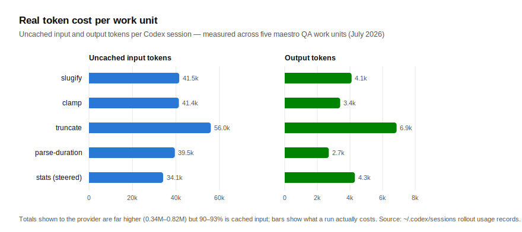
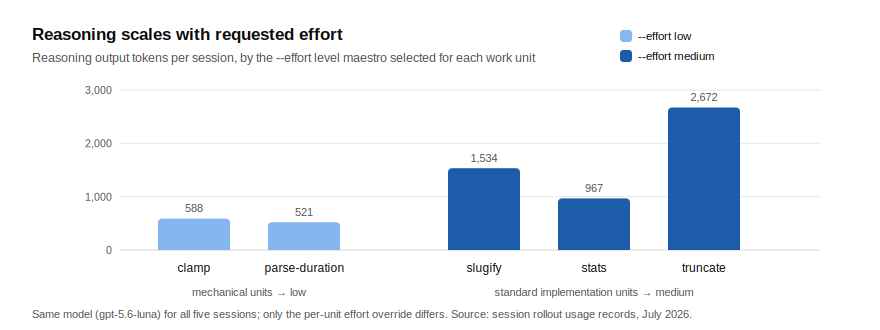

# maestro

**Claude conducts. Codex performs.**

Maestro is an orchestration harness for people who run both Claude Code and the Codex CLI. One invocation — `/maestro "task"` — has Claude analyze the task, write testable acceptance criteria, dispatch the implementation work to real Codex sessions over the app-server protocol, watch them run, and verify the results against hard evidence before anything merges.

The philosophy is a strict division of labor: **Claude is the conductor** (planning, splitting, judgment, verification); **Codex is the performer** (implementation labor). A session's final answer is treated as a claim — the only evidence maestro accepts is `git diff` against a recorded baseline plus passing builds/tests.

## Architecture

How Claude hooks the Codex app-server:

```text
┌─ Claude Code (conductor) ─────────────┐            ┌─ codex app-server ────────────────┐
│  /maestro "task"                      │            │  ws://127.0.0.1:18789             │
│                                       │  WebSocket │                                   │
│  1 ANALYZE   task → units + criteria  │  JSON-RPC  │   ┌─ session (thread) ─────────┐  │
│  2 DISPATCH  msg --approve            │            │   │  GPT-5.x                   │  │
│      --model … --effort …  ───────────┼─ turn/start ──▶│  cwd = repo or worktree    │  │
│  3 OBSERVE   active / read  ◀─────────┼─ events ───────│  edits files, runs tests   │  │
│      steer (mid-turn) / interrupt ────┼─ steer ────────▶                            │  │
│  4 VERIFY    git diff <baseline>      │            │   └────────────────────────────┘  │
│      + build/tests   (answer ≠ proof) │            │         … up to 4 in parallel     │
│  5 REWORK    defect list → same       │            └───────────────┬───────────────────┘
│      thread (≤3) → merge or escalate  │                            │ executes in
└───────────────────┬───────────────────┘                            ▼
                    │ transport: scripts/codex-query.ts   ┌─ target git repo ────────────┐
                    │ (vendored, WebSocket JSON-RPC)      │  baseline SHA captured first │
                    └─────────────────────────────────────│  one worktree + maestro/<x>  │
                                                          │  branch per parallel unit    │
                                                          │  .maestro/state.json resume  │
                                                          └──────────────────────────────┘
```

Key mechanics, pinned as verbatim command templates in the skill (so they're identical on every run):

- **Baseline first** — `git rev-parse HEAD` is recorded before any dispatch; review scope is exactly `diff <baseline>`.
- **Parallel isolation** — each concurrent unit gets its own `git worktree` on a fresh `maestro/<slug>` branch (hard cap: 4). Merges happen in dispatch order; the first conflict stops and surfaces to you.
- **Non-blocking dispatch** — `msg` runs in the background so Claude can observe, steer a drifting session mid-turn, or interrupt a runaway one.
- **Crash-safe** — thread ids, baselines, and worktrees persist to `.maestro/state.json`; an interrupted run reattaches instead of orphaning sessions.

## What it costs & how it thinks (measured)

Numbers below are from maestro's own QA runs — five real work units (implement + test utilities) dispatched to live Codex sessions in July 2026. No synthetic benchmarks.



> **Takeaway:** one finished task ≈ a 50–85-page read and a 4–10-page write for the model. The million-token totals you'd see in provider logs are ~90% cached re-reads of the same context, which are nearly free — the bars above are the real work.



> **Takeaway:** maestro matches the thinking budget to the task — simple utilities get ~550 thinking tokens, features with edge cases get 2–5× more. Deep reasoning is spent only where it pays.

What the QA runs also exercised, end to end:

| Path | Result |
|---|---|
| Acceptance-criteria verification | 26/26 tests green across merged units; every criterion checked against diff + test evidence |
| Rework loop | A deliberately failing unit was reworked in 1 round after a concrete-defect message to the same thread |
| Clarifying-question protocol | An underspecified unit stopped with one concrete question (empty diff) instead of guessing — no rework round consumed |
| Mid-turn steering | A constraint added via `steer` while the turn ran was fully incorporated in the final code |
| Honest-performer behavior | When the environment (not the code) broke a test command, the session reported the blocker precisely rather than hacking around it — and diff-based verification caught it independently |

## Why maestro (comparison)

| | `/maestro` | raw `codex exec` | manual session juggling |
|---|---|---|---|
| Acceptance criteria per dispatch | enforced, embedded verbatim | your discipline | your discipline |
| Verification | `git diff` vs baseline + build/tests, per criterion | trust the printed output | manual |
| Parallel work | worktree-isolated branches, capped, ordered merge | one-shot | tmux + memory |
| Mid-turn correction | `steer` / `interrupt` | not possible | possible, manual |
| Rework on failure | automatic, defect-named, ≤3 rounds, then escalation | re-run and re-explain | manual |
| Crash recovery | `.maestro/state.json` resume | n/a | state in your head |
| Model/effort per unit | chosen by Claude per difficulty (`--model`, `--effort`) | flags, chosen by you | chosen by you |
| Overengineering control | minimalism rule in every prompt + checked at review | — | — |

## Install

One command:

```sh
curl -fsSL https://raw.githubusercontent.com/animepics/maestro-ultra/main/install.sh | sh
```

This clones the repo to `~/.maestro` (override with `MAESTRO_DIR`), installs the transport's npm dependencies, and symlinks the skill into `~/.claude/skills/`. From a local checkout, `./install.sh` does the same without cloning.

### Prerequisites

- [Codex CLI](https://github.com/openai/codex) with app-server support, running as `codex app-server`, and **signed in** (`codex login` — requires a ChatGPT account with an eligible plan: Plus/Pro/Team/Enterprise)
- Node with TypeScript type-stripping (≥ 23.6 guaranteed; 22.18+ typically works) or Bun
- Target projects must be git repositories (verification is diff-based)
- v1 scope: local same-machine only; sandbox policy uses the app-server default

The skill's preflight checks all of this before any dispatch and tells you exactly what's missing — including when you're not logged in to Codex.

Then, in Claude Code:

```
/maestro "implement a slugify utility with full test coverage"
```

## Example run (real transcript, condensed)

```text
Phase 1  1 unit, single session — criteria: file exists, exact bytes, nothing else touched
Phase 2  baseline 718ce99 recorded → create session → msg --approve --effort low (background)
Phase 3  observing… turn completed
Phase 4  answer claims success → evidence: git diff shows only the target file;
         od -c confirms exact bytes → 3/3 criteria PASS
```

Parallel, two units:

```text
Phase 2  worktree add -b maestro/unit-a …  (same for unit-b) → two sessions concurrently
Phase 4  unit-b finishes first → verified while unit-a still runs; per-unit diffs attribute cleanly
Cleanup  merge in dispatch order → worktrees & branches removed, no leaks
```

## For Codex sessions

[`AGENTS.md`](AGENTS.md) documents the contract from the performer's side: criteria are the spec, diffs are the evidence, commit-on-branch for parallel units, ask one concrete question instead of guessing.

## Contributing

See [`CONTRIBUTING.md`](CONTRIBUTING.md). Short version: `cd scripts && npm run check` must stay green (biome + tsc + tests), the vendored transport keeps a minimal diff vs upstream (`scripts/ATTRIBUTION.md`), and skill changes need a real dispatched-session check.

## Roadmap

- **Remote `HOST=` targets** — the transport already speaks to remote app-servers; verification needs a remote-diff story (`git bundle` or SSH-side execution)
- **Per-task sandbox policy** — wrap the raw `config/value/write` RPC
- **Minimal orchestration helper** — extract deterministic mechanics into code *only if* the verbatim prose templates prove insufficient in practice
- **Rework-rate metrics** — criteria-pass-on-first-attempt tracking across runs

## License

[MIT](LICENSE)
