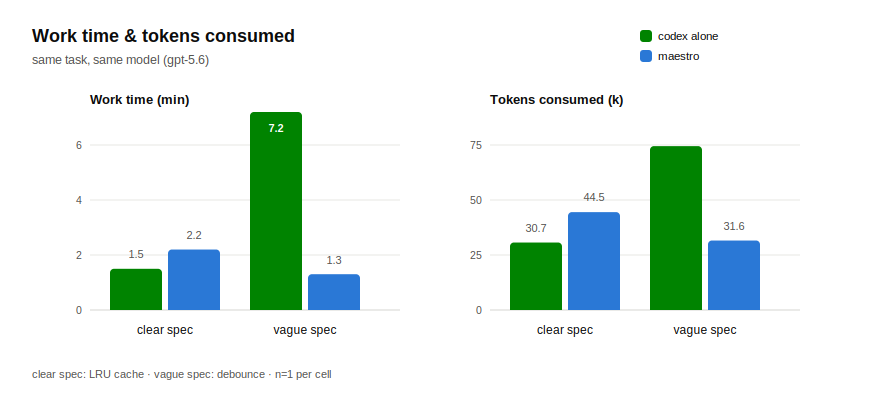
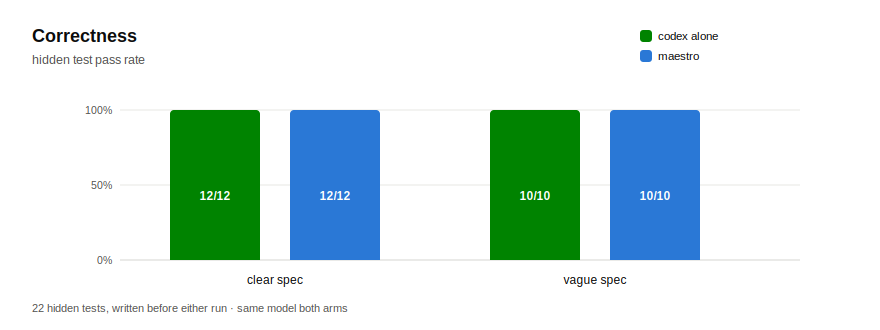

<div align="center">

# maestro-ultra

**Claude conducts. Codex performs. And every agent learns to reason like the stronger model.**

[](https://github.com/animepics/maestro-ultra/actions/workflows/ci.yml)
[](https://github.com/animepics/maestro-ultra/releases)
[](LICENSE)
[](CONTRIBUTING.md)
[](https://claude.com/claude-code)
[](https://github.com/openai/codex)
[](#strategy-skills--reasoning-like-the-stronger-model)


<h3><i>Intelligence, orchestrated.</i></h3>

<p>One maestro on the podium — every task scored, dispatched, and proven.<br>
Intent goes in, evidence-verified code comes out. Nothing merges on trust.</p>

<sub>Built on Claude Code · conducts Codex today, any performer tomorrow</sub>

</div>

> [!IMPORTANT]
> The philosophy is a strict division of labor: **Claude is the conductor** (planning, splitting, judgment, verification); **Codex is the performer** (implementation labor). A session's final answer is treated as a claim — the only evidence maestro accepts is `git diff` against a recorded baseline plus passing builds/tests.

<br>

## Install

```sh
curl -fsSL https://raw.githubusercontent.com/animepics/maestro-ultra/main/install.sh | sh
```

> [!TIP]
> No terminal needed — just tell your coding agent:
>
> ```text
> hey, install this: https://github.com/animepics/maestro-ultra
> ```

Then just talk to Claude Code:

```text
have codex implement a slugify utility with full test coverage
```

See [Prerequisites](#prerequisites) for what must be running first — the skill's preflight checks it all and tells you exactly what's missing.

<br>

## Architecture

How Claude hooks the Codex app-server:

```text
┌─ Claude Code (conductor) ─────────────┐            ┌─ codex app-server ────────────────┐
│  /maestro "task"                      │            │  ws://127.0.0.1:18789             │
│                                       │  WebSocket │                                   │
│  1 ANALYZE   task → units + criteria  │  JSON-RPC  │   ┌─ session (thread) ─────────┐  │
│  2 DISPATCH  msg --approve            │            │   │  GPT-5.x                   │  │
│      --model … --effort …  ───────────┼─ turn/start ──▶│  cwd = repo or worktree    │  │
│  3 OBSERVE   active / read  ◀─────────┼─ events ───────│  edits files, runs tests   │  │
│      steer (mid-turn) / interrupt ────┼─ steer ────────▶                            │  │
│  4 VERIFY    git diff <baseline>      │            │   └────────────────────────────┘  │
│      + build/tests   (answer ≠ proof) │            │         … up to 4 in parallel     │
│  5 REWORK    defect list → same       │            └───────────────┬───────────────────┘
│      thread (≤3) → merge or escalate  │                            │ executes in
└───────────────────┬───────────────────┘                            ▼
                    │ transport: scripts/codex-query.ts   ┌─ target git repo ────────────┐
                    │ (vendored, WebSocket JSON-RPC)      │  baseline SHA captured first │
                    └─────────────────────────────────────│  one worktree + maestro/<x>  │
                                                          │  branch per parallel unit    │
                                                          │  .maestro/state.json resume  │
                                                          └──────────────────────────────┘
```

Key mechanics, pinned as verbatim command templates in the skill (so they're identical on every run):

- **Baseline first** — `git rev-parse HEAD` is recorded before any dispatch; review scope is exactly `diff <baseline>`.
- **Parallel isolation** — each concurrent unit gets its own `git worktree` on a fresh `maestro/<slug>` branch (hard cap: 4). Merges happen in dispatch order; the first conflict stops and surfaces to you.
- **Non-blocking dispatch** — `msg` runs in the background so Claude can observe, steer a drifting session mid-turn, or interrupt a runaway one.
- **Crash-safe** — thread ids, baselines, and worktrees persist to `.maestro/state.json`; an interrupted run reattaches instead of orphaning sessions.

<br>

## Benchmark: maestro vs codex alone

Head-to-head, July 2026: the **same task text** given to a bare `codex exec` and to `/maestro`, same model, scored against a **hidden test suite written before either run**. One clear-spec task, one deliberately vague one.



> [!NOTE]
> **Takeaway:** on the vague task, codex alone took **7.2 min and 74.5k tokens** finding the semantics by trial and error; maestro finished in **1.3 min and 31.6k tokens** because the conductor pinned the spec before dispatch. On the clear task the roles reverse (~45% harness overhead) — which is why the skill's Phase 1 tells you when a task is small enough to skip the ceremony.



> [!NOTE]
> **Takeaway:** correctness tied at 100% — the difference isn't whether the code works, it's that maestro's result arrives **already verified** against diff + tests, at a fraction of the cost precisely when the spec is fuzzy.

What the QA runs also exercised, end to end:

| Path | Result |
|---|---|
| Acceptance-criteria verification | 26/26 tests green across merged units; every criterion checked against diff + test evidence |
| Rework loop | A deliberately failing unit was reworked in 1 round after a concrete-defect message to the same thread |
| Clarifying-question protocol | An underspecified unit stopped with one concrete question (empty diff) instead of guessing — no rework round consumed |
| Mid-turn steering | A constraint added via `steer` while the turn ran was fully incorporated in the final code |
| Honest-performer behavior | When the environment (not the code) broke a test command, the session reported the blocker precisely rather than hacking around it — and diff-based verification caught it independently |

<br>

## Why maestro (comparison)

| | `/maestro` | raw `codex exec` | manual session juggling |
|---|---|---|---|
| Acceptance criteria per dispatch | enforced, embedded verbatim | your discipline | your discipline |
| Verification | `git diff` vs baseline + build/tests, per criterion | trust the printed output | manual |
| Parallel work | worktree-isolated branches, capped, ordered merge | one-shot | tmux + memory |
| Mid-turn correction | `steer` / `interrupt` | not possible | possible, manual |
| Dispatch-quality gate | criteria rewritten to be testable / falsifiable / disjoint / failure-mode-aware; spec echoed back before dispatch | — | — |
| Rework on failure | automatic, defect-named, ≤3 rounds, then escalation | re-run and re-explain | manual |
| Autonomous terminal fallback | Clause A: after 3 failed rounds, one Claude attempt — but only with an independent oracle (else abort, branch preserved) | — | — |
| Quota handover | Codex quota exhausted → Claude finishes the unit in the same worktree against the same criteria; flagged honestly when no independent oracle | — | — |
| Crash recovery | `.maestro/state.json` resume | n/a | state in your head |
| Model/effort per unit | auto-routed from the live roster (`models` RPC; gpt-5.6-family workhorse, light models for mechanical units) | flags, chosen by you | chosen by you |
| Reasoning quality on smaller models | strategy skills injected per unit (`## Read first`) | — | — |
| Overengineering control | minimalism rule in every prompt + checked at review | — | — |

<br>

## Prerequisites

- [Codex CLI](https://github.com/openai/codex) with app-server support, running as `codex app-server`, and **signed in** (`codex login` — requires a ChatGPT account with an eligible plan: Plus/Pro/Team/Enterprise)
- Node with TypeScript type-stripping (≥ 23.6 guaranteed; 22.18+ typically works) or Bun
- Target projects must be git repositories (verification is diff-based)
- v1 scope: local same-machine only; sandbox policy uses the app-server default

> [!WARNING]
> Not signed in to Codex (or no eligible ChatGPT plan)? Nothing will dispatch. The skill's preflight checks all of this before any dispatch and tells you exactly what's missing — including when you're not logged in.

<br>

## Example run (real transcript, condensed)

```text
Phase 1  1 unit, single session — criteria: file exists, exact bytes, nothing else touched
Phase 2  baseline 718ce99 recorded → create session → msg --approve --effort low (background)
Phase 3  observing… turn completed
Phase 4  answer claims success → evidence: git diff shows only the target file;
         od -c confirms exact bytes → 3/3 criteria PASS
```

Parallel, two units:

```text
Phase 2  worktree add -b maestro/unit-a …  (same for unit-b) → two sessions concurrently
Phase 4  unit-b finishes first → verified while unit-a still runs; per-unit diffs attribute cleanly
Cleanup  merge in dispatch order → worktrees & branches removed, no leaks
```

### Live status — `maestro-workflows`

Ask **"maestro-workflows"** any time for one combined table of every performer currently running — Codex threads (phase, model, last event, elapsed) alongside the conductor's own background work — with an honest "no active performers" when nothing is live. The transport also ships a codex-side live view: `node scripts/codex-query.ts workflows --watch` auto-refreshes the same table (Codex threads only; Claude subagents are invisible to it).

<br>

## Strategy skills — reasoning like the stronger model

Authored here in maestro — the working copy where each skill and its evidence are written side by side — and published upstream to [ultraprompt](https://github.com/rlaope/ultraprompt) as the mirror: eight axis-sliced skills distilled from Fable 5 reasoning traces. They encode *strategy, not domain* — the same trade-off articulation pattern shows up in a kanban board and an LSM-tree, so it's captured once and transfers anywhere. Each is a standalone `SKILL.md` prompt with router-ready trigger lines, threshold heuristics, and anti-patterns; `install.sh` links them all.

| Skill | What it encodes |
|---|---|
| [exploration-strategy](skills/exploration-strategy/SKILL.md) | The order in which to build a mental model before touching anything |
| [hypothesis-management](skills/hypothesis-management/SKILL.md) | How many competing explanations to keep alive, and what evidence retires one |
| [verification-discipline](skills/verification-discipline/SKILL.md) | What counts as proof of "done" — execution, not inspection |
| [tradeoff-articulation](skills/tradeoff-articulation/SKILL.md) | Quantifying alternatives and stating the decision's cost out loud |
| [failure-mode-enumeration](skills/failure-mode-enumeration/SKILL.md) | Listing edge cases before implementation, not after the bug report |
| [self-correction-loop](skills/self-correction-loop/SKILL.md) | When to abandon an approach, and how to change course without thrashing |
| [spec-to-code-fidelity](skills/spec-to-code-fidelity/SKILL.md) | Cross-checking habits when translating an RFC, paper, or formula into code |
| [incremental-safety](skills/incremental-safety/SKILL.md) | Splitting a large change into states that are each safe to stop at |

They compose with the conductor: maestro's criteria derivation is `failure-mode-enumeration` applied before dispatch, its evidence rules are `verification-discipline`, and a Codex session that reads them performs closer to how the conductor thinks.

Four more axes are in draft — [state-probing](skills/state-probing/SKILL.md), [honest-reporting](skills/honest-reporting/SKILL.md), [delegation-parallelism](skills/delegation-parallelism/SKILL.md), and [context-memory-hygiene](skills/context-memory-hygiene/SKILL.md) — each a `v0.1 baseline draft` awaiting trace evidence from real Fable 5 runs, following the distillation protocol in [`skills/_SIMULATION.md`](skills/_SIMULATION.md): one representative task → a real session → a captured trace → a distilled axis. They stay marked as drafts, with no benchmark claims, until those traces land.

### Auto-routing + injection (v0.2)

maestro wires both halves together per work unit, automatically:

1. **Discovery** — preflight runs the new `models` command (wrapping the app-server's `model/list` RPC) and learns every model the codex account offers, with display metadata and supported reasoning efforts.
2. **Routing** — Claude picks `(model, effort)` per unit: the gpt-5.6 family is the workhorse while it's on the roster, light/fast models are reserved for clearly mechanical units, and anything stronger is saved for genuinely hard ones. The choice and one-line reasoning are always reported before dispatch; if the roster can't be fetched, maestro degrades to effort-only flags on the server default.
3. **Injection** — non-trivial dispatches open with a `## Read first` section pointing the session at the 2–3 most relevant strategy skills (mapping: debugging → hypothesis-management + self-correction-loop; spec work → spec-to-code-fidelity; design → tradeoff-articulation + failure-mode-enumeration; refactors → incremental-safety + exploration-strategy — `verification-discipline` always rides along). The dispatched model reads the same files you see above and reasons accordingly; trivial units skip the ceremony.

> [!NOTE]
> **Measured honestly** (n=3 per arm, hidden-suite blind scoring, weakest roster model): when the task is *within* the dispatched model's comfort zone, injection changes nothing — both arms scored 100% and the injected arm just paid ~+25s / ~+9k tokens reading skills it didn't need. That's exactly why the skill skips injection for trivial units, and why the mapping targets it at genuinely hard ones. Its effect on tasks that exceed the model's ability is still an open measurement.

<br>

## For Codex sessions

[`AGENTS.md`](AGENTS.md) documents the contract from the performer's side: criteria are the spec, diffs are the evidence, commit-on-branch for parallel units, ask one concrete question instead of guessing. The [strategy skills](#strategy-skills--reasoning-like-the-stronger-model) above are written to be readable by Codex sessions too — `verification-discipline` and `failure-mode-enumeration` are the two that pay off first.

<br>

## Contributing

See [`CONTRIBUTING.md`](CONTRIBUTING.md). Short version: `cd scripts && npm run check` must stay green (biome + tsc + tests), the vendored transport keeps a minimal diff vs upstream (`scripts/ATTRIBUTION.md`), and skill changes need a real dispatched-session check.

<br>

## Roadmap

- **Remote `HOST=` targets** — the transport already speaks to remote app-servers; verification needs a remote-diff story (`git bundle` or SSH-side execution)
- **Per-task sandbox policy** — wrap the raw `config/value/write` RPC
- **Minimal orchestration helper** — extract deterministic mechanics into code *only if* the verbatim prose templates prove insufficient in practice
- **Rework-rate metrics** *(shipped 0.3.0)* — an append-only `.maestro/metrics.jsonl` outcome ledger now records per-unit criteria-pass-on-first-attempt, model/effort, rework rounds, and who resolved it. Durable (never deleted), same-machine local only — no upload or aggregation service

<br>

## Maintainers

- [@rlaope](https://github.com/rlaope)

<br>

## License

[MIT](LICENSE)
